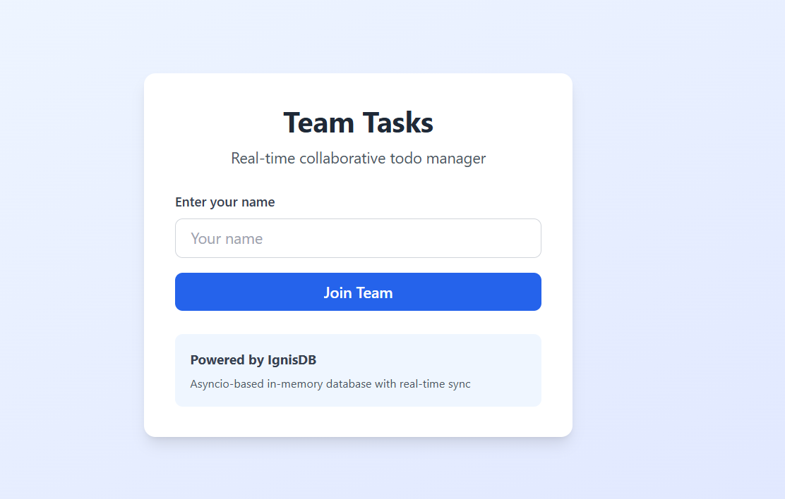
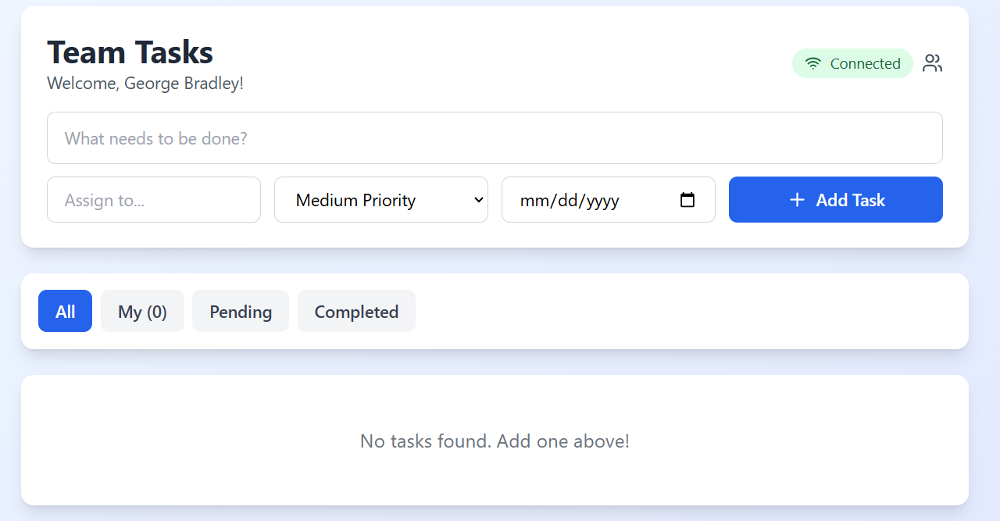
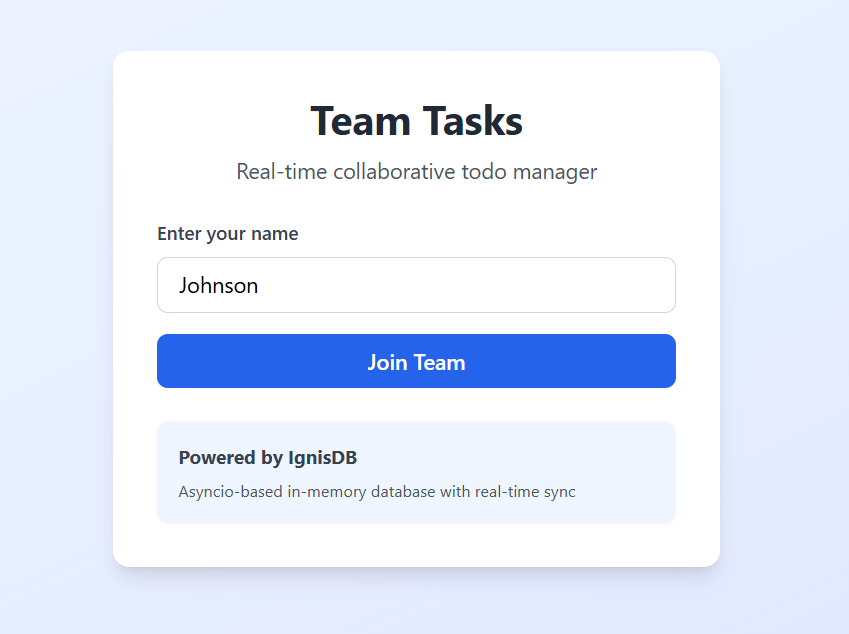
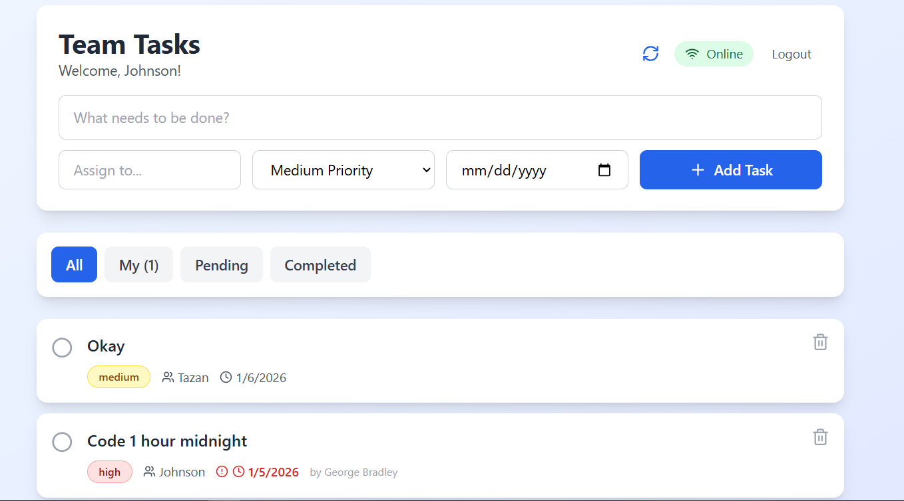
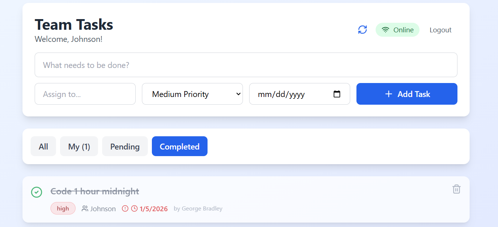
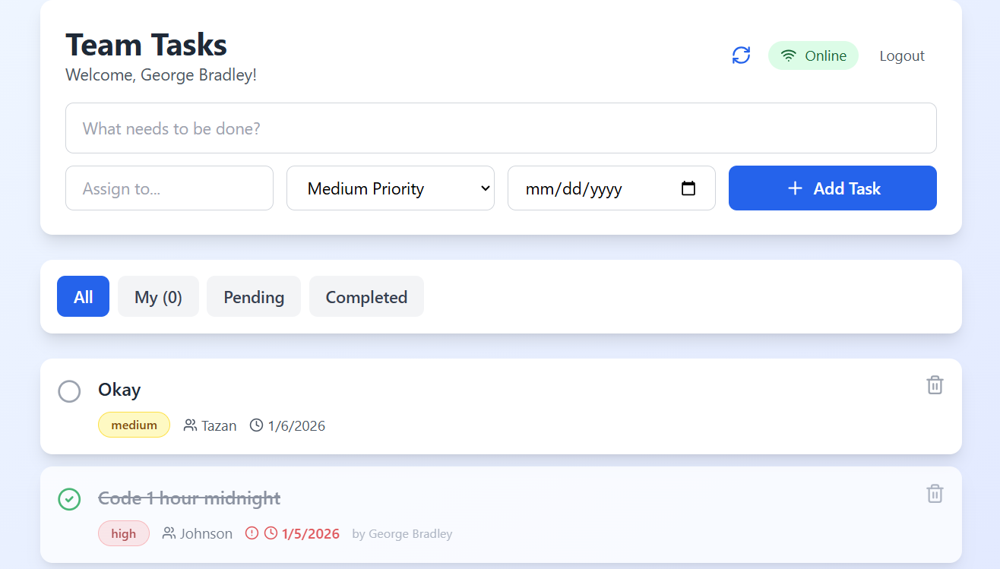

# IgnisDB Team Tasks - Real-Time Collaborative Todo Manager

[](https://github.com/buraksocial/IgnisDB/stargazers)
[](https://github.com/Giathi-Daniel/IgnisDB/stargazers)
[](https://github.com/buraksocial/IgnisDB/network/members)
[](https://opensource.org/licenses/MIT)
[](https://react.dev/)
[](https://vitejs.dev/)

> A real-time collaborative todo/task manager built with React, WebSockets, and IgnisDB.

Welcome to **IgnisDB Team Tasks**! This is the official simple web frontend for the IgnisDB project—a real-time collaborative task manager that demonstrates how modern web applications stay in sync across multiple users. Whether you're a developer learning about WebSockets and real-time databases, or a team looking for a lightweight task management tool, this application has something for you.

The frontend connects seamlessly to the IgnisDB backend through a WebSocket bridge server, allowing team members to add, update, and complete tasks while seeing changes instantly. Everything is stored persistently in both the database and your browser's local storage, so you never lose your data.

### Features

* **Real-Time Collaboration**: Multiple users can view and edit the same task list simultaneously. When someone adds, updates, or deletes a task, everyone sees the change instantly—no refreshing required.
* **Offline Support with IndexedDB**: All tasks are stored locally in your browser's IndexedDB, providing robust offline support. If your internet connection drops, you can keep working and sync when you're back online.
* **Task Management**: Create tasks with titles, assign them to team members, set priority levels (low, medium, high), and define due dates. Toggle tasks as completed or delete them when done.
* **Smart Filtering**: Filter tasks to see all tasks, just your assigned tasks, pending tasks, or completed tasks. The filter buttons make it easy to focus on what matters most.
* **Connection Status**: The interface shows when you're connected to the server and synced (green "Online" badge), or when you're working offline (orange "Offline" badge).
* **Auto-Reconnect**: If the WebSocket connection drops due to network issues, the frontend automatically attempts to reconnect every 5 seconds.
* **Modern UI**: Built with React 19 and styled with Tailwind CSS, featuring gradient backgrounds, smooth animations, and a clean, responsive design.

### Tech Stack

* **React 19.2** - Modern component-based UI framework with hooks
* **Vite 7.2** - Lightning-fast build tool and development server
* **Tailwind CSS** - Utility-first CSS framework (loaded via CDN)
* **Lucide React** - Beautiful, consistent SVG icons
* **WebSocket API** - Bidirectional real-time communication
* **IndexedDB** - Client-side database for offline storage
* **ESLint** - Code quality and consistency

### Quick Start

1. **Start the IgnisDB server** (in one terminal):
   ```bash
   python ignisdb_server.py
   ```

2. **Start the WebSocket bridge** (in another terminal):
   ```bash
   python todo_server.py
   ```

3. **Start the frontend** (in a third terminal):
   ```bash
   cd frontend
   npm install
   npm run dev
   ```

4. **Open your browser** to `http://localhost:5173`

5. **Test collaboration** by opening the app in multiple browser windows with different usernames!

### Project Structure

```
frontend/
├── src/
│   ├── main.jsx              # Application entry point
│   ├── App.jsx               # Root React component
│   └── components/
│       └── CollaborativeTodoManager.jsx  # Main todo management logic
├── index.html                # HTML template with Tailwind CDN
├── package.json              # Project dependencies
├── vite.config.js            # Vite configuration
├── eslint.config.js          # ESLint configuration
└── README.md                 # This file
```

### How It Works

The frontend connects to IgnisDB through a WebSocket bridge server:

1. **React Frontend** maintains a WebSocket connection to `ws://localhost:8765`
2. When you create, update, or delete a task, a JSON message is sent over WebSocket
3. The `todo_server.py` bridge translates JSON to IgnisDB's RESP protocol commands
4. Changes are broadcast to all connected clients for real-time sync
5. All tasks are stored in IndexedDB for offline access and persistence

### Screenshots


*The login screen - enter your name to join the team*


*The main dashboard with task list and controls*


*Creating a new task with assignee, priority, and due date*


*A second user logging in to test collaboration*


*Both users see the same synchronized task list*


*Completing a task updates for all users instantly*


*Real-time sync from the sender's perspective*

### IgnisDB Commands Used

The frontend uses these IgnisDB commands behind the scenes:

* `LPUSH tasks:list <task_id>` - Add task ID to the ordered list
* `HSET task:<id> <field> <value>` - Store task properties (title, status, assignee, priority, dueDate, createdBy, createdAt)
* `HGET task:<id> <field>` - Retrieve a specific field from a task
* `LRANGE tasks:list 0 -1` - Get all task IDs
* `DELETE task:<id>` - Remove a task entirely
* `EXPIRE task:<id> <seconds>` - Set time-to-live based on due date

### Contributing

Contributions are welcome! Feel free to open issues or submit pull requests. No contribution is too small—even fixing a typo in the documentation is appreciated.

1. Fork the project
2. Create your feature branch (`git checkout -b feature/amazing-feature`)
3. Commit your changes (`git commit -am 'feat: Add amazing feature'`)
4. Push to the branch (`git push origin feature/amazing-feature`)
5. Open a Pull Request

### License

This project is licensed under the MIT License. See the [LICENSE](LICENSE) file for details.

---

**Built with ❤️ as part of the IgnisDB project**

*A collaborative effort to build a database from scratch and explore real-time web applications.*
```

---

